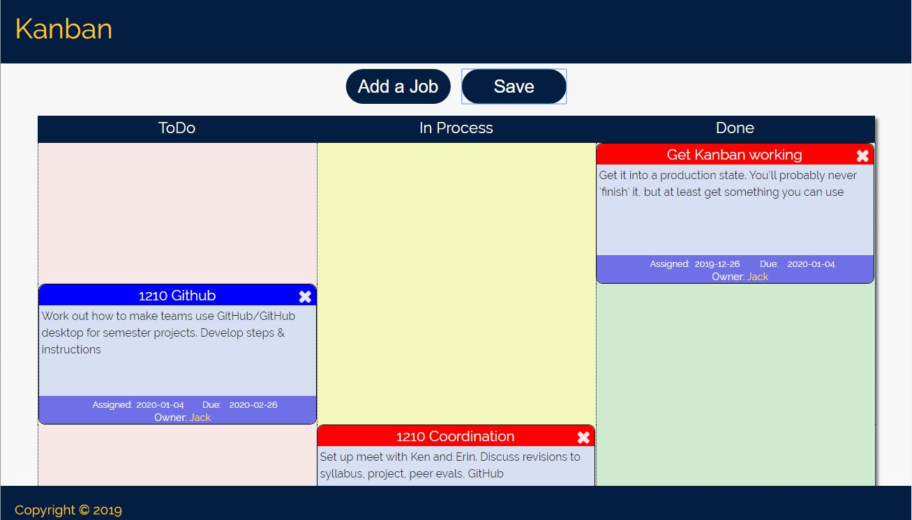

# kanban
 Basic working Kanban board

I started this as a project to improve my mastery of JavaScript and jQuery. Now, after many days' work, it's working and, as far as I can tell, error-free

Jobs are stored as cards in a flat-file format. When a card is added/updated, the data file is also updated. I had one glitch during testing, where the data file and table mysteriously disappeared, but I haven't been able to replicate it

Update: 

Oh yeah, I forgot -- Obviously, you can add jobs by clicking the 'Add' button. New cards are inserted at the top of the table. It shouldn't be necessary to use the 'Save Table' button, but I included explicit saves as a safety measure. The priority option will set the background color for each card's heading - green for low; blue for medium; and red for high.

Existing cards can be edited by double clicking on the card and updating the appropriate information. 

If the user doesn't select a date, the current date will be added as the default. If the user doesn't select a due date, the current date is used. Priority defaults to low

In light of the 'glitch' I mentioned above, for which I have no explanation, if you find yourself using this seriously, it'd probably be a good idea to save backups of the data/data.dat file periodically.

In the event you do find bugs (I don't claim that this solution is especially elegant -- still learning), I'd love to hear about them. 

I have some future plans for the app, but really have to start getting things ready for my students. It's working now, even if it doesn't do everything I'd like :) 

Update 2020-01-15
Feature addition: rows are now sortable. One problem I haven't fixed yet: users can drop a row over the column header row. Caveat emptor
